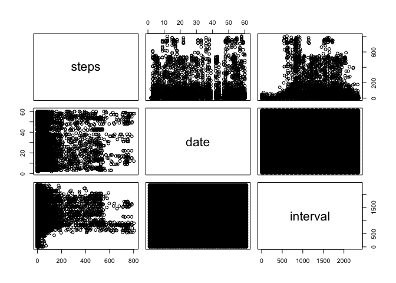
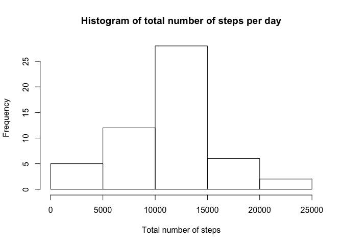
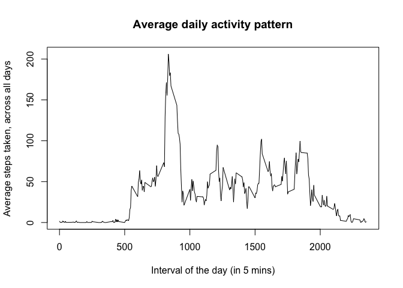
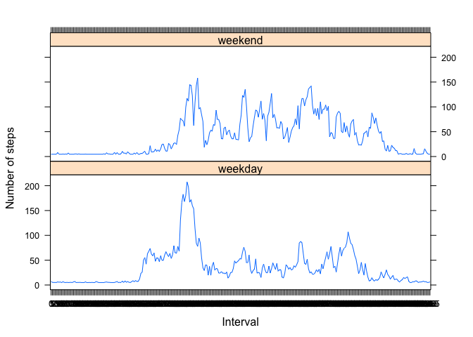

We employ data from a personal device. This device collects data at 5 minute intervals through out the day. The data consists of two months of data from an anonymous individual collected during the months of October and November, 2012 and include the number of steps taken in 5 minute intervals each day.

## Loading and preprocessing the data
First, I remove everything in my environment and set the working directory and load the libraries

```r
rm(list=ls())
setwd("~/Documents/GitHub/RepData_PeerAssessment1")
library(dplyr)
```

```
## 
## Attaching package: 'dplyr'
```

```
## The following objects are masked from 'package:stats':
## 
##     filter, lag
```

```
## The following objects are masked from 'package:base':
## 
##     intersect, setdiff, setequal, union
```

```r
library(ggplot2)
library(R.utils)
```

```
## Loading required package: R.oo
```

```
## Loading required package: R.methodsS3
```

```
## R.methodsS3 v1.8.0 (2020-02-14 07:10:20 UTC) successfully loaded. See ?R.methodsS3 for help.
```

```
## R.oo v1.23.0 successfully loaded. See ?R.oo for help.
```

```
## 
## Attaching package: 'R.oo'
```

```
## The following object is masked from 'package:R.methodsS3':
## 
##     throw
```

```
## The following objects are masked from 'package:methods':
## 
##     getClasses, getMethods
```

```
## The following objects are masked from 'package:base':
## 
##     attach, detach, load, save
```

```
## R.utils v2.9.2 successfully loaded. See ?R.utils for help.
```

```
## 
## Attaching package: 'R.utils'
```

```
## The following object is masked from 'package:utils':
## 
##     timestamp
```

```
## The following objects are masked from 'package:base':
## 
##     cat, commandArgs, getOption, inherits, isOpen, parse, warnings
```

```r
library(rmarkdown)
library(knitr)
library(readr)
library(mice)
```

```
## 
## Attaching package: 'mice'
```

```
## The following objects are masked from 'package:base':
## 
##     cbind, rbind
```

```r
library(lattice)
```
And load the data, which must be unzip first (read.csv does it automatically)

```r
unzip(zipfile="activity.zip")
list.files()
```

```
## [1] "activity.csv"       "activity.zip"       "doc"               
## [4] "instructions_fig"   "PA1_template_files" "PA1_template.html" 
## [7] "PA1_template.md"    "PA1_template.Rmd"   "README.md"
```

```r
data = read.csv("activity.csv", header=TRUE)
```
We explore the data and check the class of the columns


```r
colnames(data)
```

```
## [1] "steps"    "date"     "interval"
```

```r
head(data)
```

```
##   steps       date interval
## 1    NA 2012-10-01        0
## 2    NA 2012-10-01        5
## 3    NA 2012-10-01       10
## 4    NA 2012-10-01       15
## 5    NA 2012-10-01       20
## 6    NA 2012-10-01       25
```

```r
str(data)
```

```
## 'data.frame':	17568 obs. of  3 variables:
##  $ steps   : int  NA NA NA NA NA NA NA NA NA NA ...
##  $ date    : Factor w/ 61 levels "2012-10-01","2012-10-02",..: 1 1 1 1 1 1 1 1 1 1 ...
##  $ interval: int  0 5 10 15 20 25 30 35 40 45 ...
```

```r
pairs(data)
```

<!-- -->
We see that we have 3 columns and 17568 observations. Steps and interval are already in integer format, while Date is in Factor format. We keep it by now, as it will ease the analysis of the following question. 


## What is mean total number of steps taken per day?
1. Calculate the total number of steps taken per day. 


For this part of the assignment, we are requested to ignore the missing values in the dataset. We compute the total number of steps per day, and plot it into a histogram:

```r
sum_data = data %>% group_by(date) %>% summarise(total_steps=sum(steps))
```

```
## `summarise()` ungrouping output (override with `.groups` argument)
```
2. Make a histogram of the total number of steps taken each day


```r
hist(sum_data$total_steps, main= "Histogram of total number of steps per day", xlab="Total number of steps", ylab="Frequency")
```

<!-- -->


3. Calculate and report the mean and median of the total number of steps taken per day

We obtain the mean and median steps during the period:

```r
sum_data %>% summarise(mean_steps=mean(total_steps, na.rm=TRUE),median_steps=median(total_steps, na.rm=TRUE))
```

```
## # A tibble: 1 x 2
##   mean_steps median_steps
##        <dbl>        <int>
## 1     10766.        10765
```

As we can observe, the owner of the devices takes in mean 10766 steps per day. Median is very close, which suggests distribution is not very much skewed.


## What is the average daily activity pattern?
1. Make a time series plot of the 5-minute interval (x-axis) and the average number of steps taken, averaged across all days (y-axis)

I try to understand the variables first:

```r
unique(data$interval)
```

```
##   [1]    0    5   10   15   20   25   30   35   40   45   50   55  100  105  110
##  [16]  115  120  125  130  135  140  145  150  155  200  205  210  215  220  225
##  [31]  230  235  240  245  250  255  300  305  310  315  320  325  330  335  340
##  [46]  345  350  355  400  405  410  415  420  425  430  435  440  445  450  455
##  [61]  500  505  510  515  520  525  530  535  540  545  550  555  600  605  610
##  [76]  615  620  625  630  635  640  645  650  655  700  705  710  715  720  725
##  [91]  730  735  740  745  750  755  800  805  810  815  820  825  830  835  840
## [106]  845  850  855  900  905  910  915  920  925  930  935  940  945  950  955
## [121] 1000 1005 1010 1015 1020 1025 1030 1035 1040 1045 1050 1055 1100 1105 1110
## [136] 1115 1120 1125 1130 1135 1140 1145 1150 1155 1200 1205 1210 1215 1220 1225
## [151] 1230 1235 1240 1245 1250 1255 1300 1305 1310 1315 1320 1325 1330 1335 1340
## [166] 1345 1350 1355 1400 1405 1410 1415 1420 1425 1430 1435 1440 1445 1450 1455
## [181] 1500 1505 1510 1515 1520 1525 1530 1535 1540 1545 1550 1555 1600 1605 1610
## [196] 1615 1620 1625 1630 1635 1640 1645 1650 1655 1700 1705 1710 1715 1720 1725
## [211] 1730 1735 1740 1745 1750 1755 1800 1805 1810 1815 1820 1825 1830 1835 1840
## [226] 1845 1850 1855 1900 1905 1910 1915 1920 1925 1930 1935 1940 1945 1950 1955
## [241] 2000 2005 2010 2015 2020 2025 2030 2035 2040 2045 2050 2055 2100 2105 2110
## [256] 2115 2120 2125 2130 2135 2140 2145 2150 2155 2200 2205 2210 2215 2220 2225
## [271] 2230 2235 2240 2245 2250 2255 2300 2305 2310 2315 2320 2325 2330 2335 2340
## [286] 2345 2350 2355
```

```r
unique(data$date)
```

```
##  [1] 2012-10-01 2012-10-02 2012-10-03 2012-10-04 2012-10-05 2012-10-06
##  [7] 2012-10-07 2012-10-08 2012-10-09 2012-10-10 2012-10-11 2012-10-12
## [13] 2012-10-13 2012-10-14 2012-10-15 2012-10-16 2012-10-17 2012-10-18
## [19] 2012-10-19 2012-10-20 2012-10-21 2012-10-22 2012-10-23 2012-10-24
## [25] 2012-10-25 2012-10-26 2012-10-27 2012-10-28 2012-10-29 2012-10-30
## [31] 2012-10-31 2012-11-01 2012-11-02 2012-11-03 2012-11-04 2012-11-05
## [37] 2012-11-06 2012-11-07 2012-11-08 2012-11-09 2012-11-10 2012-11-11
## [43] 2012-11-12 2012-11-13 2012-11-14 2012-11-15 2012-11-16 2012-11-17
## [49] 2012-11-18 2012-11-19 2012-11-20 2012-11-21 2012-11-22 2012-11-23
## [55] 2012-11-24 2012-11-25 2012-11-26 2012-11-27 2012-11-28 2012-11-29
## [61] 2012-11-30
## 61 Levels: 2012-10-01 2012-10-02 2012-10-03 2012-10-04 ... 2012-11-30
```

And then produce the metrics and the plot:


```r
avg_steps_by_interval= data %>% group_by(interval) %>% summarise(avg_by_interval=mean(steps, na.rm=TRUE))
```

```
## `summarise()` ungrouping output (override with `.groups` argument)
```

```r
plot(avg_steps_by_interval$interval, avg_steps_by_interval$avg_by_interval, xlab= "Interval of the day (in 5 mins)", ylab="Average steps taken, across all days", main= "Average daily activity pattern", type="l")
```

<!-- -->

2. Which 5-minute interval, on average across all the days in the dataset, contains the maximum number of steps?".


```r
intervalmaxsteps <- avg_steps_by_interval[which.max(avg_steps_by_interval$avg_by_interval),]$interval
intervalmaxsteps 
```

```
## [1] 835
```

The 825th interval is the one with the maximum number of steps.


## Imputing missing values

1. Calculate and report the total number of missing values in the dataset (i.e. the total number of rows with NAs):


```r
sum(is.na(data)) 
```

```
## [1] 2304
```

```r
sum(is.na(data$steps))
```

```
## [1] 2304
```

There are 2304 missing data, all of them in the steps variable

2. Devise a strategy for filling in all of the missing values in the dataset. The strategy does not need to be sophisticated. For example, you could use the mean/median for that day, or the mean for that 5-minute interval, etc.


```r
imputed_data = data
meanvalue=mean(data$steps, na.rm=TRUE)
imputed_data$steps[is.na(imputed_data$steps)] <- meanvalue
sum(is.na(data$steps))
```

```
## [1] 2304
```

```r
sum(is.na(data))
```

```
## [1] 2304
```

```r
sum(is.na(imputed_data))
```

```
## [1] 0
```


3. Create a new dataset that is equal to the original dataset but with the missing data filled in.

Already done in previous point

4. Make a histogram of the total number of steps taken each day and Calculate and report the mean and median total number of steps taken per day. Do these values differ from the estimates from the first part of the assignment? What is the impact of imputing missing data on the estimates of the total daily number of steps?


```r
str(imputed_data)
```

```
## 'data.frame':	17568 obs. of  3 variables:
##  $ steps   : num  37.4 37.4 37.4 37.4 37.4 ...
##  $ date    : Factor w/ 61 levels "2012-10-01","2012-10-02",..: 1 1 1 1 1 1 1 1 1 1 ...
##  $ interval: int  0 5 10 15 20 25 30 35 40 45 ...
```

```r
sum_data2 = imputed_data %>% group_by(date) %>% summarise(total_steps=sum(steps))
```

```
## `summarise()` ungrouping output (override with `.groups` argument)
```

```r
hist(sum_data$total_steps, main= "Histogram of total number of steps per day", xlab="Total number of steps", ylab="Frequency")
```

<!-- -->


```r
sum_data2 %>% summarise(mean_steps=mean(total_steps), median_steps=median(total_steps))
```

```
## # A tibble: 1 x 2
##   mean_steps median_steps
##        <dbl>        <dbl>
## 1     10766.       10766.
```

Once missing values have been imputed, both the histogram and mean/median change. Mean and median coincide now.

## Are there differences in activity patterns between weekdays and weekends?

For this part the weekdays() function may be of some help here. Use the dataset with the filled-in missing values for this part.

1. Create a new factor variable in the dataset with two levels – “weekday” and “weekend” indicating whether a given date is a weekday or weekend day.


```r
imputed_data$date <- as.Date(imputed_data$date, format ="%Y-%m-%d")
imputed_data$day <- weekdays(imputed_data$date)

imputed_data$day <- factor(format(imputed_data$date, "%A"))
levels(imputed_data$day)
```

```
## [1] "Friday"    "Monday"    "Saturday"  "Sunday"    "Thursday"  "Tuesday"  
## [7] "Wednesday"
```

```r
levels(imputed_data$day) <- list(weekday = c("Monday", "Tuesday",
                                             "Wednesday", 
                                             "Thursday", "Friday"),
                                 weekend = c("Saturday", "Sunday"))
levels(imputed_data$day)
```

```
## [1] "weekday" "weekend"
```

```r
table(imputed_data$day)
```

```
## 
## weekday weekend 
##   12960    4608
```


2. Make a panel plot containing a time series plot of the 5-minute interval (x-axis) and the average number of steps taken, averaged across all weekday days or weekend days (y-axis). See the README file in the GitHub repository to see an example of what this plot should look like using simulated data.


```r
imputed_data$interval = as.factor(imputed_data$interval)
sum_data3 = imputed_data %>% group_by(interval, day) %>% summarise(mean_steps=mean(steps))
```

```
## `summarise()` regrouping output by 'interval' (override with `.groups` argument)
```

```r
xyplot(sum_data3$mean_steps ~ sum_data3$interval | sum_data3$day, 
       layout = c(1, 2), type = "l", 
       xlab = "Interval", ylab = "Number of steps")
```

<!-- -->


